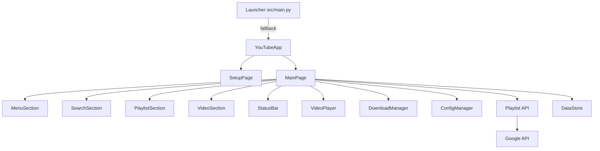
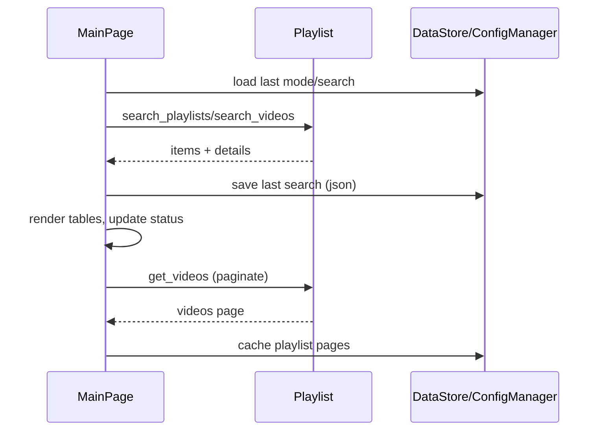

# Implementation Guide

## File Structure
- `src/`
  - `main.py` — launcher and runtime fallback
  - `youtube_app.py` — app controller and multipage setup
  - `pages/` — Tkinter frames and sections
  - `data/` — persistence backends and factories
  - `playlist.py` — YouTube API integrations
  - `config_manager.py` — configuration and last search management
  - `security.py` — security tagging utilities
- `docs/` — project documentation
- `tests/` — unit tests

## Main Layers
- UI Layer: frames in `src/pages/main` (`MainPage`, sections)
- Domain Layer: `src/playlist.py` provides search and detail operations
- Persistence Layer: `src/data` for last results and optional DB
- Configuration Layer: `src/config_manager.py`
- Runtime/Launcher: `src/main.py`

## Core Components
- `YouTubeApp` (`src/youtube_app.py:8`) manages pages and config
- `MainPage` (`src/pages/main/main_page.py:23`) orchestrates sections
- `Playlist` (`src/playlist.py:6`) wraps YouTube Data API endpoints
- `ConfigManager` (`src/config_manager.py:12`) persists settings and history

## Block Diagram

## Dataflow Diagram

## Implementation Steps
- Setup
  - Ensure keys in `.env` or `settings.py:API_KEY`.
  - Confirm `PERSISTENCE_MODE` if switching stores.
- Playlists Mode
  - Search via `Playlist.search_playlists` and enrich with `get_details`.
  - Render playlists; open to fetch videos with pagination.
- Videos Mode
  - Search via `Playlist.search_videos`; render; collect related playlists.
  - Support back-to-results restoration and highlighting.
- Security Tagging
  - Use `security.apply_security_tag("src")` during runtime startup.

## User Stories
- As a viewer, I can search videos and highlight results for quick scanning.
- As a curator, I can open a playlist and paginate through its videos.
- As a power user, I can restore previous search results after reopening the app.
- As a downloader, I can save videos in MP4 with progress feedback.

