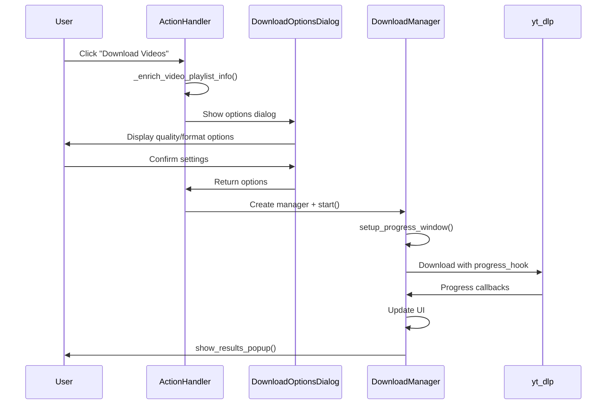

# Download Module Integration Guide

This document describes the download feature architecture and how to integrate or extend it.

## Architecture

```
src/pages/main/
├── download_options_dialog.py  # Pre-download configuration UI
├── download_manager.py         # Core download orchestration
└── handlers/
    └── action_handler.py       # Triggers downloads via _start_download_for_videos
```

## Key Components

### 1. DownloadOptionsDialog
Pre-download configuration modal.

**Usage:**
```python
from src.pages.main.download_options_dialog import DownloadOptionsDialog

dlg = DownloadOptionsDialog(parent_widget)
if dlg.result:
    # User confirmed - dlg.result contains options dict
    # Keys: quality, format, concurrent_fragments, etc.
```

### 2. DownloadManager
Handles the actual download process with progress tracking.

**Constructor:**
```python
DownloadManager(parent, videos, download_folder, options)
```

| Parameter | Type | Description |
|-----------|------|-------------|
| parent | tk.Widget | Parent window for progress dialog |
| videos | List[Dict] | List of video dicts with `videoId`, `title`, `playlistId` |
| download_folder | str | Target folder (can be None for auto) |
| options | Dict | Options from DownloadOptionsDialog |

**Methods:**
- `start()` - Begin downloading in background thread
- `cancel_download()` - Stop current download
- `open_folder()` - Open download folder in explorer

### 3. Integration in ActionHandler

```python
def _start_download_for_videos(self, videos, folder=None):
    """Initiate download for selected videos."""
    # 1. Enrich videos with playlist info for folder organization
    self._enrich_video_playlist_info(videos)
    
    # 2. Show options dialog
    dlg = DownloadOptionsDialog(self.main_page)
    if not dlg.result:
        return
    
    # 3. Start download manager
    DownloadManager(self.main_page, videos, folder, dlg.result).start()
```

## Download Flow



## Video Data Structure

```python
video = {
    'videoId': 'abc123',           # YouTube video ID (required)
    'title': 'Video Title',        # Display title
    'channelTitle': 'Channel',     # Channel name
    'playlistId': 'PLxxx',         # Optional - for folder organization
    'playlistIndex': 1,            # Optional - playlist number
    'duration': '05:30',           # Display duration
}
```

## Folder Organization

Downloads are organized by playlist when available:

```
download_folder/
├── Playlist - Engineering Videos/
│   ├── video1.mp4
│   └── video2.mp4
├── Channel Name/
│   └── standalone_video.mp4
└── Misc/
    └── unknown_source.mp4
```

## Performance Optimizations

The current implementation achieves fast downloads through:

1. **Concurrent fragments** - yt-dlp's multi-threaded fragment downloading
2. **Batch processing** - Download queue handled in single thread
3. **Chunked UI updates** - Progress UI updated at intervals, not every byte
4. **Background threading** - Downloads don't block main UI thread

## Extending the Module

### Add New Download Options

1. Add UI controls in `DownloadOptionsDialog`:
```python
self.my_option_var = tk.StringVar(value="default")
ttk.Label(self, text="My Option:").pack()
ttk.Entry(self, textvariable=self.my_option_var).pack()
```

2. Include in result dict:
```python
self.result = {
    ...,
    'my_option': self.my_option_var.get()
}
```

3. Use in `DownloadManager.download_videos()`:
```python
my_opt = self.options.get('my_option', 'default')
ydl_opts['my_option'] = my_opt
```

### Add Post-Download Processing

Add to `download_videos()` after successful download:
```python
# After download completes
if status == 'ok':
    self._post_process(video, output_path)
```
